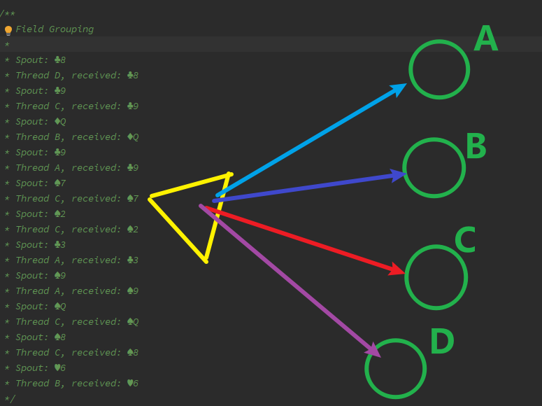
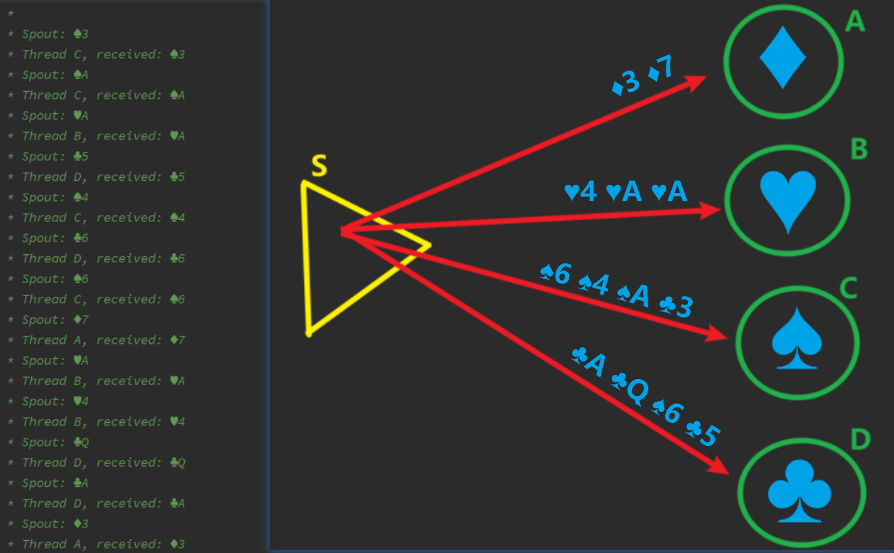
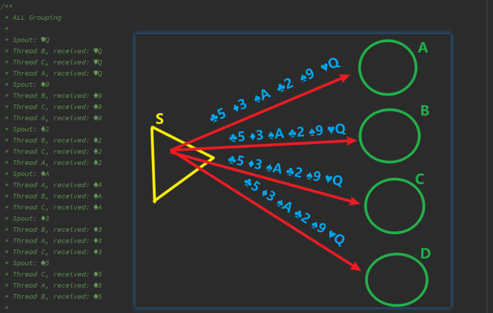

# Stream Grouping

Stream Grouping定义了一个流在Bolt任务间该如何被切分，谁来处理哪些数据流，按照什么规则来分配.

下面我们使用Storm来模拟一个人给四个人分发扑克牌。

## 随机分组

Shuffle Grouping- 随机分组， 随机派发stream里面的tuple，保证每个bolt接收到的tuple数目大致相同。



## 字段分组

​	- 按字段分组， 比如按userid来分组， 具有同样userid的tuple会被分到相同的Bolts里的一个task， 而不同的userid则会被分配到不同的bolts里的task



## 广播分组

All grouping- 广播发送，对于每一个tuple，所有的bolt都会收到



## 全局分组

Global Grouping- 全局分组， 这个tuple被分配到storm中的一个bolt的其中一个task。再具体一点就是分配给id值最低的那个task。	

## 无分组

None Grouping- 不分组，这个分组的意思是说stream不关心到底谁会收到它的tuple。目前这种分组和Shuffle grouping是一样的效果， 有一点不同的是storm会把这个bolt放到这个bolt的订阅者同一个线程里面去执行。

## 直接分组

Direct Grouping——直接分组， 这是一种比较特别的分组方法，用这种分组意味着消息的发送者指定由消息接收者的哪个task处理这个消息。 只有被声明为Direct Stream的消息流可以声明这种分组方法。而且这种消息tuple必须使用emitDirect方法来发射。消息处理者可以通过TopologyContext来获取处理它的消息的task的id （OutputCollector.emit方法也会返回task的id）。

## 本地或随机分组

Local or shuffle grouping - 如果目标bolt有一个或者多个task在同一个工作进程中，tuple将会被随机发生给这些tasks。否则，和普通的Shuffle Grouping行为一致。


## PartialKeyGrouping

实例

```java
    @Test
    public void testPartialKeyGrouping() throws InvalidTopologyException, AuthorizationException, AlreadyAliveException {
        String spoutId = "wordGenerator";
        String counterId = "counter";
        String aggId = "aggregator";
        String intermediateRankerId = "intermediateRanker";
        String totalRankerId = "finalRanker";
        int TOP_N = 5;

        TopologyBuilder builder = new TopologyBuilder();
        builder.setSpout(spoutId, new TestWordSpout(), 5);
        //NOTE 通过partialKeyGrouping替代fieldsGrouping，实现较为均衡的负载到countBolt
        builder.setBolt(counterId, new RollingCountBolt(9, 3), 4).partialKeyGrouping(spoutId, new Fields("word"));
        builder.setBolt(aggId, new RollingCountAggBolt(), 4).fieldsGrouping(counterId, new Fields("obj"));
        builder.setBolt(intermediateRankerId, new IntermediateRankingsBolt(TOP_N), 4).fieldsGrouping(aggId, new Fields("obj"));
        builder.setBolt(totalRankerId, new TotalRankingsBolt(TOP_N)).globalGrouping(intermediateRankerId);
        submitRemote(builder);
    }
```

- 值得注意的是在wordCount的bolt使用PartialKeyGrouping，同一个单词不再固定发给相同的task，因此这里还需要RollingCountAggBolt按fieldsGrouping进行合并。

PartialKeyGrouping(`1.2.2版`)

`storm-core-1.2.2-sources.jar!/org/apache/storm/grouping/PartialKeyGrouping.java`

```java
public class PartialKeyGrouping implements CustomStreamGrouping, Serializable {
    private static final long serialVersionUID = -447379837314000353L;
    private List<Integer> targetTasks;
    private long[] targetTaskStats;
    private HashFunction h1 = Hashing.murmur3_128(13);
    private HashFunction h2 = Hashing.murmur3_128(17);
    private Fields fields = null;
    private Fields outFields = null;

    public PartialKeyGrouping() {
        //Empty
    }

    public PartialKeyGrouping(Fields fields) {
        this.fields = fields;
    }

    @Override
    public void prepare(WorkerTopologyContext context, GlobalStreamId stream, List<Integer> targetTasks) {
        this.targetTasks = targetTasks;
        targetTaskStats = new long[this.targetTasks.size()];
        if (this.fields != null) {
            this.outFields = context.getComponentOutputFields(stream);
        }
    }

    @Override
    public List<Integer> chooseTasks(int taskId, List<Object> values) {
        List<Integer> boltIds = new ArrayList<>(1);
        if (values.size() > 0) {
            byte[] raw;
            if (fields != null) {
                List<Object> selectedFields = outFields.select(fields, values);
                ByteBuffer out = ByteBuffer.allocate(selectedFields.size() * 4);
                for (Object o: selectedFields) {
                    if (o instanceof List) {
                        out.putInt(Arrays.deepHashCode(((List)o).toArray()));
                    } else if (o instanceof Object[]) {
                        out.putInt(Arrays.deepHashCode((Object[])o));
                    } else if (o instanceof byte[]) {
                        out.putInt(Arrays.hashCode((byte[]) o));
                    } else if (o instanceof short[]) {
                        out.putInt(Arrays.hashCode((short[]) o));
                    } else if (o instanceof int[]) {
                        out.putInt(Arrays.hashCode((int[]) o));
                    } else if (o instanceof long[]) {
                        out.putInt(Arrays.hashCode((long[]) o));
                    } else if (o instanceof char[]) {
                        out.putInt(Arrays.hashCode((char[]) o));
                    } else if (o instanceof float[]) {
                        out.putInt(Arrays.hashCode((float[]) o));
                    } else if (o instanceof double[]) {
                        out.putInt(Arrays.hashCode((double[]) o));
                    } else if (o instanceof boolean[]) {
                        out.putInt(Arrays.hashCode((boolean[]) o));
                    } else if (o != null) {
                        out.putInt(o.hashCode());
                    } else {
                      out.putInt(0);
                    }
                }
                raw = out.array();
            } else {
                raw = values.get(0).toString().getBytes(); // assume key is the first field
            }
            int firstChoice = (int) (Math.abs(h1.hashBytes(raw).asLong()) % this.targetTasks.size());
            int secondChoice = (int) (Math.abs(h2.hashBytes(raw).asLong()) % this.targetTasks.size());
            int selected = targetTaskStats[firstChoice] > targetTaskStats[secondChoice] ? secondChoice : firstChoice;
            boltIds.add(targetTasks.get(selected));
            targetTaskStats[selected]++;
        }
        return boltIds;
    }
}
```

- 可以看到PartialKeyGrouping是一种CustomStreamGrouping，在prepare的时候，初始化了long[] targetTaskStats用于统计每个task
- partialKeyGrouping如果没有指定fields，则默认按outputFields的第一个field来计算
- 这里使用guava类库提供的Hashing.murmur3_128函数，构造了两个HashFunction，然后计算哈希值的绝对值与targetTasks.size()取余数得到两个可选的taskId下标
- 然后根据targetTaskStats的统计值，取用过的次数小的那个taskId，选中之后更新targetTaskStats

PartialKeyGrouping(`2.0.0版`)

`storm-2.0.0/storm-client/src/jvm/org/apache/storm/grouping/PartialKeyGrouping.java`

```java
/**
 * A variation on FieldGrouping. This grouping operates on a partitioning of the incoming tuples (like a FieldGrouping), but it can send
 * Tuples from a given partition to multiple downstream tasks.
 *
 * Given a total pool of target tasks, this grouping will always send Tuples with a given key to one member of a subset of those tasks. Each
 * key is assigned a subset of tasks. Each tuple is then sent to one task from that subset.
 *
 * Notes: - the default TaskSelector ensures each task gets as close to a balanced number of Tuples as possible - the default
 * AssignmentCreator hashes the key and produces an assignment of two tasks
 */
public class PartialKeyGrouping implements CustomStreamGrouping, Serializable {
    private static final long serialVersionUID = -1672360572274911808L;
    private List<Integer> targetTasks;
    private Fields fields = null;
    private Fields outFields = null;

    private AssignmentCreator assignmentCreator;
    private TargetSelector targetSelector;

    public PartialKeyGrouping() {
        this(null);
    }

    public PartialKeyGrouping(Fields fields) {
        this(fields, new RandomTwoTaskAssignmentCreator(), new BalancedTargetSelector());
    }

    public PartialKeyGrouping(Fields fields, AssignmentCreator assignmentCreator) {
        this(fields, assignmentCreator, new BalancedTargetSelector());
    }

    public PartialKeyGrouping(Fields fields, AssignmentCreator assignmentCreator, TargetSelector targetSelector) {
        this.fields = fields;
        this.assignmentCreator = assignmentCreator;
        this.targetSelector = targetSelector;
    }

    @Override
    public void prepare(WorkerTopologyContext context, GlobalStreamId stream, List<Integer> targetTasks) {
        this.targetTasks = targetTasks;
        if (this.fields != null) {
            this.outFields = context.getComponentOutputFields(stream);
        }
    }

    @Override
    public List<Integer> chooseTasks(int taskId, List<Object> values) {
        List<Integer> boltIds = new ArrayList<>(1);
        if (values.size() > 0) {
            final byte[] rawKeyBytes = getKeyBytes(values);

            final int[] taskAssignmentForKey = assignmentCreator.createAssignment(this.targetTasks, rawKeyBytes);
            final int selectedTask = targetSelector.chooseTask(taskAssignmentForKey);

            boltIds.add(selectedTask);
        }
        return boltIds;
    }

    /**
     * Extract the key from the input Tuple.
     */
    private byte[] getKeyBytes(List<Object> values) {
        byte[] raw;
        if (fields != null) {
            List<Object> selectedFields = outFields.select(fields, values);
            ByteBuffer out = ByteBuffer.allocate(selectedFields.size() * 4);
            for (Object o : selectedFields) {
                if (o instanceof List) {
                    out.putInt(Arrays.deepHashCode(((List) o).toArray()));
                } else if (o instanceof Object[]) {
                    out.putInt(Arrays.deepHashCode((Object[]) o));
                } else if (o instanceof byte[]) {
                    out.putInt(Arrays.hashCode((byte[]) o));
                } else if (o instanceof short[]) {
                    out.putInt(Arrays.hashCode((short[]) o));
                } else if (o instanceof int[]) {
                    out.putInt(Arrays.hashCode((int[]) o));
                } else if (o instanceof long[]) {
                    out.putInt(Arrays.hashCode((long[]) o));
                } else if (o instanceof char[]) {
                    out.putInt(Arrays.hashCode((char[]) o));
                } else if (o instanceof float[]) {
                    out.putInt(Arrays.hashCode((float[]) o));
                } else if (o instanceof double[]) {
                    out.putInt(Arrays.hashCode((double[]) o));
                } else if (o instanceof boolean[]) {
                    out.putInt(Arrays.hashCode((boolean[]) o));
                } else if (o != null) {
                    out.putInt(o.hashCode());
                } else {
                    out.putInt(0);
                }
            }
            raw = out.array();
        } else {
            raw = values.get(0).toString().getBytes(); // assume key is the first field
        }
        return raw;
    }

    //......
}
```

- 2.0.0版本将逻辑封装到了RandomTwoTaskAssignmentCreator以及BalancedTargetSelector中

RandomTwoTaskAssignmentCreator

`storm-2.0.0/storm-client/src/jvm/org/apache/storm/grouping/PartialKeyGrouping.java`

```java
    /**
     * This interface is responsible for choosing a subset of the target tasks to use for a given key.
     *
     * NOTE: whatever scheme you use to create the assignment should be deterministic. This may be executed on multiple Storm Workers, thus
     * each of them needs to come up with the same assignment for a given key.
     */
    public interface AssignmentCreator extends Serializable {
        int[] createAssignment(List<Integer> targetTasks, byte[] key);
    }

    /*========== Implementations ==========*/

    /**
     * This implementation of AssignmentCreator chooses two arbitrary tasks.
     */
    public static class RandomTwoTaskAssignmentCreator implements AssignmentCreator {
        /**
         * Creates a two task assignment by selecting random tasks.
         */
        public int[] createAssignment(List<Integer> tasks, byte[] key) {
            // It is necessary that this produce a deterministic assignment based on the key, so seed the Random from the key
            final long seedForRandom = Arrays.hashCode(key);
            final Random random = new Random(seedForRandom);
            final int choice1 = random.nextInt(tasks.size());
            int choice2 = random.nextInt(tasks.size());
            // ensure that choice1 and choice2 are not the same task
            choice2 = choice1 == choice2 ? (choice2 + 1) % tasks.size() : choice2;
            return new int[]{ tasks.get(choice1), tasks.get(choice2) };
        }
    }
```

- 2.0.0版本不再使用guava类库提供的Hashing.murmur3_128哈希函数，转而使用key的哈希值作为seed，采用Random函数来计算两个taskId的下标，这里返回两个值供bolt做负载均衡选择

BalancedTargetSelector

`storm-2.0.0/storm-client/src/jvm/org/apache/storm/grouping/PartialKeyGrouping.java

```php
    /**
     * This interface chooses one element from a task assignment to send a specific Tuple to.
     */
    public interface TargetSelector extends Serializable {
        Integer chooseTask(int[] assignedTasks);
    }

    /**
     * A basic implementation of target selection. This strategy chooses the task within the assignment that has received the fewest Tuples
     * overall from this instance of the grouping.
     */
    public static class BalancedTargetSelector implements TargetSelector {
        private Map<Integer, Long> targetTaskStats = Maps.newHashMap();

        /**
         * Chooses one of the incoming tasks and selects the one that has been selected the fewest times so far.
         */
        public Integer chooseTask(int[] assignedTasks) {
            Integer taskIdWithMinLoad = null;
            Long minTaskLoad = Long.MAX_VALUE;

            for (Integer currentTaskId : assignedTasks) {
                final Long currentTaskLoad = targetTaskStats.getOrDefault(currentTaskId, 0L);
                if (currentTaskLoad < minTaskLoad) {
                    minTaskLoad = currentTaskLoad;
                    taskIdWithMinLoad = currentTaskId;
                }
            }

            targetTaskStats.put(taskIdWithMinLoad, targetTaskStats.getOrDefault(taskIdWithMinLoad, 0L) + 1);
            return taskIdWithMinLoad;
        }
    }
```

- BalancedTargetSelector根据选中的taskId，然后根据targetTaskStats计算taskIdWithMinLoad返回

FieldsGrouper

`storm-2.0.0/storm-client/src/jvm/org/apache/storm/daemon/GrouperFactory.java`

```java
    public static class FieldsGrouper implements CustomStreamGrouping {

        private Fields outFields;
        private List<List<Integer>> targetTasks;
        private Fields groupFields;
        private int numTasks;

        public FieldsGrouper(Fields outFields, Grouping thriftGrouping) {
            this.outFields = outFields;
            this.groupFields = new Fields(Thrift.fieldGrouping(thriftGrouping));

        }

        @Override
        public void prepare(WorkerTopologyContext context, GlobalStreamId stream, List<Integer> targetTasks) {
            this.targetTasks = new ArrayList<List<Integer>>();
            for (Integer targetTask : targetTasks) {
                this.targetTasks.add(Collections.singletonList(targetTask));
            }
            this.numTasks = targetTasks.size();
        }

        @Override
        public List<Integer> chooseTasks(int taskId, List<Object> values) {
            int targetTaskIndex = TupleUtils.chooseTaskIndex(outFields.select(groupFields, values), numTasks);
            return targetTasks.get(targetTaskIndex);
        }

    }
```

- 这里可以看到FieldsGrouper的chooseTasks方法使用TupleUtils.chooseTaskIndex来选择taskId下标

TupleUtils.chooseTaskIndex

`storm-2.0.0/storm-client/src/jvm/org/apache/storm/utils/TupleUtils.java`

```java
    public static <T> int chooseTaskIndex(List<T> keys, int numTasks) {
        return Math.floorMod(listHashCode(keys), numTasks);
    }

    private static <T> int listHashCode(List<T> alist) {
        if (alist == null) {
            return 1;
        } else {
            return Arrays.deepHashCode(alist.toArray());
        }
    }
```

- 这里先对keys进行listHashCode，然后与numTasks进行Math.floorMod运算，即向下取模
- listHashCode调用了Arrays.deepHashCode(alist.toArray())进行哈希值计算

小结

- storm的PartialKeyGrouping是解决fieldsGrouping造成的bolt节点skewed load的问题
- fieldsGrouping采取的是对所选字段进行哈希然后与taskId数量向下取模来选择taskId的下标
- PartialKeyGrouping在1.2.2版本的实现是使用guava提供的Hashing.murmur3_128哈希函数计算哈希值，然后取绝对值与taskId数量取余数得到两个可选的taskId下标；在2.0.0版本则使用key的哈希值作为seed，采用Random函数来计算两个taskId的下标。注意这里返回两个值供bolt做负载均衡选择，这是与fieldsGrouping的差别。在得到两个候选taskId之后，PartialKeyGrouping额外维护了taskId的使用数，每次选择使用少的，与此同时也更新每次选择的计数。
- 值得注意的是在wordCount的bolt使用PartialKeyGrouping，同一个单词不再固定发给相同的task，因此这里还需要RollingCountAggBolt按fieldsGrouping进行合并计数。

doc

- [Common Topology Patterns](https://link.segmentfault.com/?url=http%3A%2F%2Fstorm.apache.org%2Freleases%2F1.2.2%2FCommon-patterns.html)
- [The Power of Both Choices: Practical Load Balancing for Distributed Stream Processing Engines](https://link.segmentfault.com/?url=https%3A%2F%2Fmelmeric.files.wordpress.com%2F2014%2F11%2Fthe-power-of-both-choices-practical-load-balancing-for-distributed-stream-processing-engines.pdf)
- [Storm-源码分析-Streaming Grouping (backtype.storm.daemon.executor)](https://link.segmentfault.com/?url=https%3A%2F%2Fwww.cnblogs.com%2Ffxjwind%2Fp%2F3216704.html)